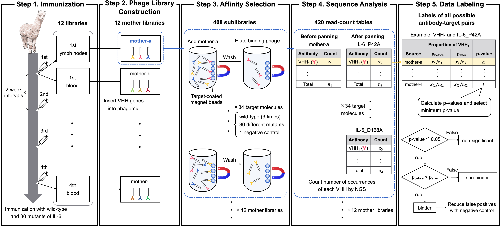

# AVIDa-hIL6: A Large-Scale VHH Dataset Produced from an Immunized Alpaca for Predicting Antigen-Antibody Interactions

This repository contains the supplementary material accompanying the paper, AVIDa-hIL6: A Large-Scale VHH Dataset Produced from an Immunized Alpaca for Predicting Antigen-Antibody Interactions.
The dataset is available at https://avida-hil6.cognanous.com under a CC BY-NC-SA 4.0 license.



<div style="text-align: center;">
Overview of the data generation process.
</div>

## Table of Contents

- [Environment](#environment)
- [Dataset](#dataset)
  - [Downloads](#downloads)
  - [Labeled Dataset](#labeled-dataset)
  - [Data Processing](#data-processing)
- [Benchmarks](#benchmarks)
  - [Data Splitting](#data-splitting)
  - [Sequence Encoding](#sequence-encoding)
  - [Model Training and Evaluation](#model-training-and-evaluation)
- [Citation](#citation)

## Environment

To get started, clone this repository and run the following command to create a virtual environment.

```bash
python3 -m venv ./venv
source ./venv/bin/activate
pip install -r requirements.txt
```

## Dataset

### Downloads

| Dataset                             |                                             Download                                             |
|-------------------------------------|:------------------------------------------------------------------------------------------------:|
| Raw data (840 FASTQ file)           | [Link to Google Drive](https://drive.google.com/drive/folders/1dfB2jcwb8NrHQnqRcK4m6RRs95c5nZVm) |
| VHH sequences data (420 FASTA file) | [Link to Google Drive](https://drive.google.com/drive/folders/1pWqgUzCSW_agGPTcMNPpMzZTmfotWL4K) |
| Labeled dataset (1 CSV file)        |                     [Link to Zenodo](https://doi.org/10.5281/zenodo.7935861)                     |

For more information, see the [AVIDa-hIL6 project page](https://avida-hil6.cognanous.com).

### Labeled Dataset

A labeled CSV file has four columns as shown below.

| Column       | Description                                                                       |
|--------------|:----------------------------------------------------------------------------------|
| VHH_sequence | Amino acid sequence of VHH                                                        |
| Ag_sequence  | Amino acid sequence of IL-6 protein                                               |
| Ag_label     | Type of IL-6 protein                                                              |
| label        | Binary label represented by 1 for the binding pair and 0 for the non-binding pair |

A labeled dataset contains 573,891 data samples, comprising 20,980 binding pairs and 552,911 non-binding pairs.
The following figure shows the number of data samples for each antigen type.


### Data Processing

A Labeled dataset is generated through the following workflow.
The scripts highlighted in blue can be found in the [dataset](dataset/) folder.


Here is how to generate a labeled CSV file from a raw FASTQ files.
First, you need to create a Docker image.

```bash
docker build -t avida-hil6:latest .
```

After placing the raw data (FASTAQ files) under `data/`, execute the following command to output a labeled CSV file: `out/il6_aai_dataset.csv`.

```bash
./dataset/preprocess.sh
```

## Benchmarks

### Data Splitting

We recommend splitting the dataset based on the type of IL-6 protein to predict the impact of antigen mutations on antibody binding.
For example, to create a training set containing "IL-6_WTs" and "IL-6_G63A", filter the dataset using the `Ag_label` column as follows.

```bash
dataset_df = pd.read_csv("il6_aai_dataset.csv")
training_df = dataset_df[dataset_df["Ag_label"].isin(["IL-6_WTs", "IL-6_G63A"])]
training_df.to_csv("training_set.csv", index=False)
```

### Sequence Encoding

We implemented the following three encoding methods.
The CSV file will be converted to npz files by executing the following commands.

1. CKSAAP encoding for AbAgIntPre

    ```bash
    python benchmarks/encodings/CKSAAP.py --data-path "training_set.csv" --file-name "train_CKSAAP"
    ```

2. Pre-trained skip-gram model based encoding for PIPR

    ```bash
    python benchmarks/encodings/skipgram.py --data-path "training_set.csv" --file-name "train_skipgram"
    ```

3. One-hot encoding for MLP

    ```bash
    python benchmarks/encodings/onehot.py --data-path "training_set.csv" --file-name "train_onehot"
    ```

**Arguments:**

| Argument    | Required | Default                                        | Description                                 |
|-------------|----------|------------------------------------------------|---------------------------------------------|
| --data-path | Yes      || Path of the target CSV file to be preprocessed |
| --save-dir  | No       | "."                                            | Directory to save the preprocessed npz file |
| --file-name | No       | "il6_aai_dataset"                              | Name of output npz file                     |

### Model Training and Evaluation

The model is trained using `train-data` and evaluated using `test-data` by executing the following commands.
Make sure to use the appropriate encoding npz file according to `model-name`.

```bash
python benchmarks/train.py --train-data "train_CKSAAP.npz" \
  --test-data "test_CKSAAP.npz" \
  --model-name "AbAgIntPre" \
  --epochs 100 \
  --batch-size 256 \
  --amp "True"
```

After training is completed, evaluation metrics for the test data are output.

```bash
Test: loss 0.0705, accuracy 0.9891, AUROC 0.9468, AUPRC 0.8286, precision 0.9452, recall 0.7488, f1 0.8356, MCC 0.8361
```

**Arguments:**

| Argument      | Required | Default   | Description                                               |
|---------------|----------|-----------|-----------------------------------------------------------|
| --train-data  | Yes      |           | Path of training data                                     |
| --test-data   | Yes      |           | Path of test data                                         |
| --model-name  | Yes      |           | Model name ("AbAgIntPre" or "PIPR" or "MLP"])             |
| --valid-ratio | No       | 0.1       | Ratio used for validation data from training data         |
| --save-dir    | No       | "./saved" | Save directory path                                       |
| --epochs      | No       | 20        | Number of epochs                                          |
| --batch-size  | No       | 256       | Size of mini-batch                                        |
| --amp         | No       | False     | Use Automatic Mixed Precision to save memory usage        |
| --run-id      | No       |           | Run ID used for the directory name for saving the results |
| --model-path  | No       |           | Model path used for retraining                            |

## Citation

If you use AVIDa-hIL6 in your research, please use the following citation:

```
TBD
```
